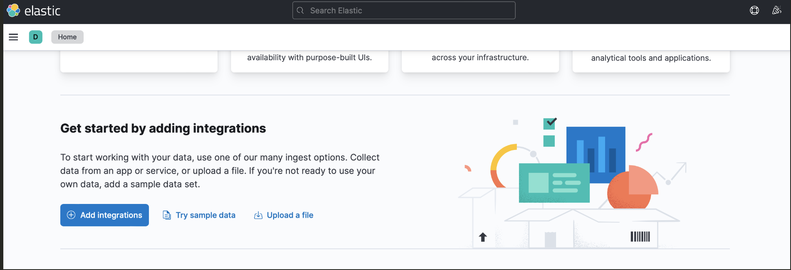
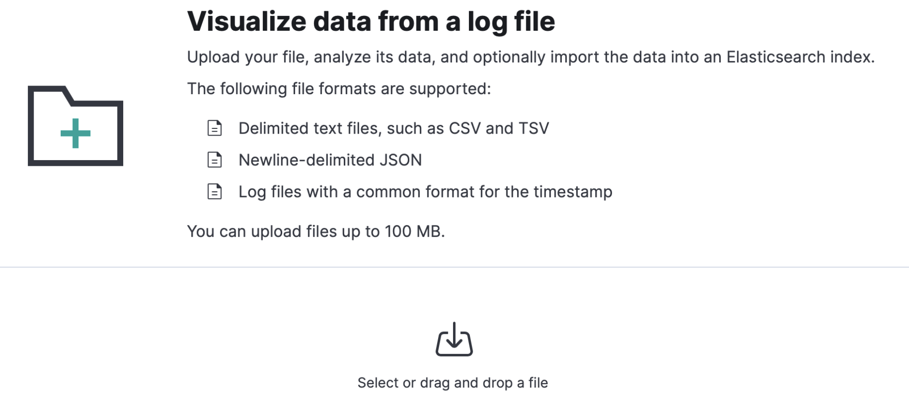
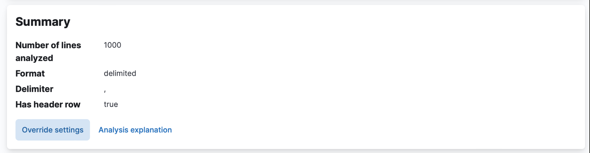
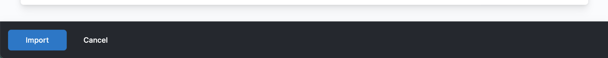
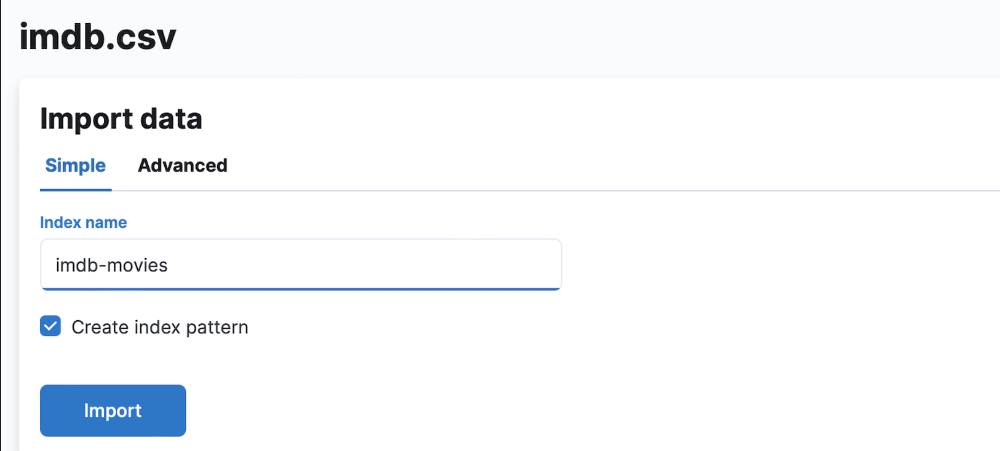

# Pureinsight's Backend Engineer Technical Test

This project presents a simple REST API with search capabilities using an [Elasticsearch](https://www.elastic.co)
search engine, in which, an index populated with
the [IMDB Most Popular Films and Series dataset](https://www.kaggle.com/mazenramadan/imdb-most-popular-films-and-series) is created using Kibana.

The REST API has two endpoints that perform the following:
1. Get all titles that match a provided genre. For example: all titles marked as ‘Action’
2. Get all titles which rating is above a provide value. For example: all titles with a rating above 8.0

## Pre-requirements
- [Java 17](https://www.oracle.com/java/technologies/downloads/#java17)
- [Gradle 7.3.3](https://gradle.org/releases/)
- [Docker Desktop](https://www.docker.com/get-started/)

## Ingestion

To index the IMDB Most Popular Films and Series dataset available in https://www.kaggle.com/mazenramadan/imdb-most-popular-films-and-series run the steps below.

### 1. Create elasticsearch instance in docker

```shell
docker network create elastic
docker pull docker.elastic.co/elasticsearch/elasticsearch:7.17.11
docker run --name es-pi-test --net elastic -p 127.0.0.1:9200:9200 -p 127.0.0.1:9300:9300 -e "discovery.type=single-node" docker.elastic.co/elasticsearch/elasticsearch:7.17.11
```

### 2. Create kibana instance in docker

```shell
docker pull docker.elastic.co/kibana/kibana:7.17.11                                                       
docker run --name kib-pi-test --net elastic -p 127.0.0.1:5601:5601 -e "ELASTICSEARCH_HOSTS=http://es-pi-test:9200" docker.elastic.co/kibana/kibana:7.17.11
```
### 3. Index file using kibana
- Download the IMDB Most Popular Films and Series dataset available in https://www.kaggle.com/mazenramadan/imdb-most-popular-films-and-series.
- Open your browser and go to http://localhost:5601/app/home#/
- Scroll down and click on "Upload a file"

- Click on "Select or drag and drop a file"
  
- Select the imdb.csv file that was downloaded before
- Click on "Override settings" to modify the number of lines to sample. In this case it would be the number of lines in the imdb.csv files: 6178
  
- Click on the "Import button" in the footer
  
- Write "imdb-movies" as the index name
- Click on Import
  
- Wait for the index to be created and click on "Index Management" to verify that the index was created

## Running the REST API
```shell
./gradlew bootRun
```

The command will start a Tomcat server in the port 8080. A [Swagger](https://swagger.io/)
UI will be available in http://localhost:8080/swagger-ui/index.html.
